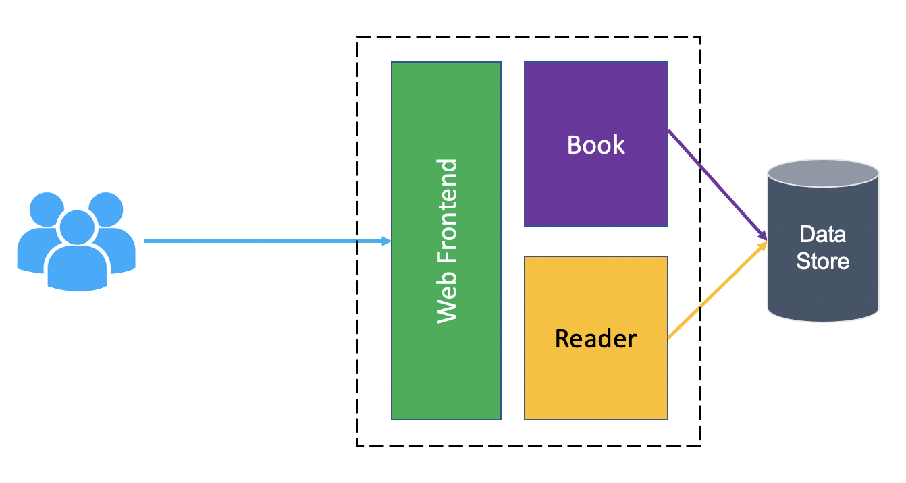
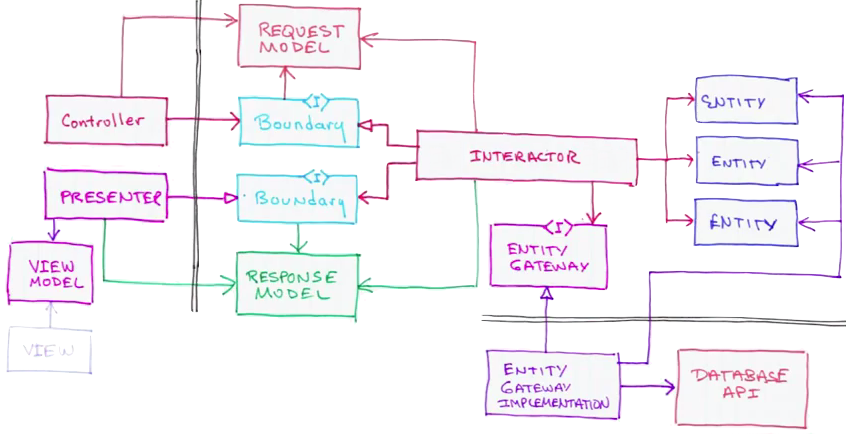
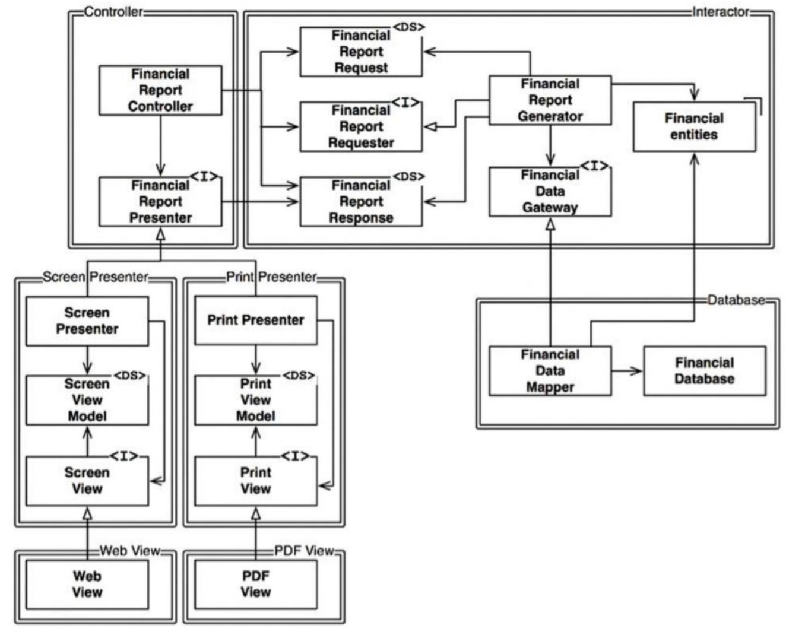

# Spring Boot application designed as per the Clean Architecture pattern

This demo is my take on how to apply the [Clean Architecture](https://blog.cleancoder.com/uncle-bob/2012/08/13/the-clean-architecture.html) pattern and concepts from the wonderful [Clean Architecture: A Craftsman's Guide to Software Structure and Design](https://www.goodreads.com/book/show/18043011-clean-architecture) book by Uncle Bob when developing a Spring Boot application.

I consider the Clean Architecture an evolution of the *Hexagonal Architecture* and *Onion Architecture* patterns, although all of these software architectures are very similar. They all have the same objective, which is the **separation of concerns**. They all achieve this separation by dividing the software into layers.

However, I find the Clean Architecture more opnionated and prescriptive for guiding us through the craft of structuring our applications in order to garantee that they can grow without building up **cruft** - deficiencies in internal quality that make it harder than it would ideally be to modify and extend the application further. In other words, the famous *technical debit*.

## Screaming Architecture

Another characteristic of this application architecture that draws attention is that **the architecture screams** at you when you look at the top-level directory structure, that is the source files in the highest-level package clearly supports the use cases and the purpose of the application. You can read more about this in the chapter 21 of the Uncle Bob's book.

This application implements a *Web Library* and this purpose is promptly revealed when we look at the top-level structure in the project directory.

This clear separation between the application's main modules makes this application an example of **Modular Monolith** and might well prove itself very useful in the future should we decide to break this application into microservices. By the way, I used the concept of **Bounded Contexts** from [Domain-Driven Design](https://en.wikipedia.org/wiki/Domain-driven_design) when defining the application modules.

To give you a sense on how the *Clean Architecture* compares to the *Model-View-Controller Architecture*, you can find [here](https://github.com/dbaltor/tanzu-mvc-lib) the very same *Web Library* application implemented using the MVC architecture. 

## The Dependency Rule

The overriding rule that makes this architecture work says that **source code dependencies can only point inwards**. Nothing in an inner circle can know anything at all about something in an outer circle. In particular, the name of something declared in an outer circle must not be mentioned by the code in the an inner circle. That includes, functions, classes. variables, or any other named software entity.

This rule is important as it makes sure that our use cases are completely independent of peripheral details such as frameworks, databases and web servers.

I have conciously decided to break this rule in two occasions when implementing this application for pragmatic reasons:
1. Regardless what circle they are in, objects are marked as *Spring-managed components* by using common <b>Spring bean annotations</b> such as `@Component`, `@Sevice` and `@Controller`. This allows Spring to automatically manage their life cycles whilst being easily removable should we choose to change frameworks.
1. Objects in the outer **Interface Adapters** layer such as *Controllers*, *Presenters* and *Gateways* are free to refer to Spring annotations. This has hugely reduced the required amount of boilerplate but comes at the cost of coupling this layer to the framework of choice. I basically accept the cost of having to rewrite this layer in case of replacing Spring for another framework.

## Interactor calling the Presenter or returning data?

The most well-known approach to implement the *Clean Architecture* is the *Interactor* (use case) to call the *Presenter* when it is done. The purpose of the *Presenter* is to decouple the use cases from the format of the UI.

However, I prefer to allow the *Interactor* to return data to the *Controller* which then call the *Presenter*. I find this approach is better supported when using MVC frameworks such as Spring and still implements *Presenters* as described by Uncle Bob, this time in the chapter 8 of his book: **OCP - THE OPEN-CLOSED PRINCIPLE**.

This is the approach I followed in this application.

---
## How to use the application
You can generate 10 readers at a time clicking on the *Load Readers* button. 

You can generate 100 books at a time clicking on the *Load Books* button. The first 40 books will show up as borrowed by some readers.

You can visualise the list of readers and books following the corresponding links. Use the browser's back buttom to return to the home page.
